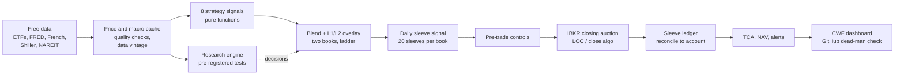
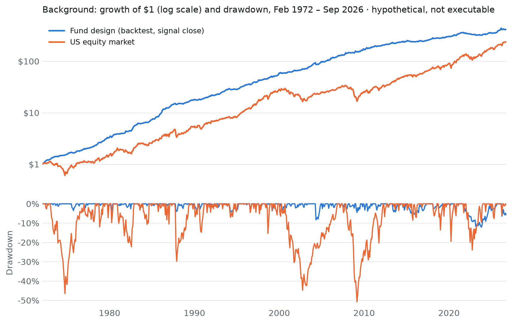

# The Wife Fund: Building and Testing a Systematic Multi-Strategy ETF Portfolio

**James Crowell** · October 2026

A systematic portfolio that blends eight published tactical asset-allocation strategies under a macro regime overlay. It is taken from primary-source research to a tested Python research environment, and then to an automated, reconciled and monitored paper-trading operation.

| At a glance | |
|---|---|
| **Role** | Designer, researcher and portfolio manager (sole). Software built with Claude Code as engineering partner |
| **Scope** | Strategy research → data and backtest engine → execution design → live paper trading → monitoring |
| **Scale** | 8 strategies, 19 ETFs, 2 books, 40 sleeves; ~20,000 lines of Python, 116 modules, 400+ tests, 80+ research notes |
| **Data** | Free sources only: ETF prices plus index and macro histories stitched back to 1926 |
| **Discipline** | Every design test registered before its result is seen; unflattering results reported, never discarded |
| **Focus** | The research process, execution design and operations. Backtest results are background context, not a performance claim |
| **Stack** | pandas, NumPy, SciPy, pytest, parquet, Interactive Brokers API (ib_async), FRED and French data, GitHub Actions |

**Contents:** [1 Summary](#1-summary) · [2 Investment design](#2-the-investment-design) · [3 Research environment](#3-the-research-environment) · [4 Research discipline](#4-research-discipline) · [5 Findings](#5-what-the-research-found) · [6 Execution](#6-execution-from-a-signal-to-a-fill) · [7 Two books](#7-two-books-and-drawdown-control) · [8 Operations](#8-running-it-paper-trading-and-operations) · [9 Results and limits](#9-results-and-what-they-do-not-show) · [10 Skills and lessons](#10-skills-and-lessons)

> **Disclaimer.** This document describes a personal research and paper-trading project. All performance figures are hypothetical: they come from backtests or from a simulated (paper) brokerage account. They are shown gross of fees and transaction costs except where stated. Hypothetical results have inherent limits: they are produced with hindsight, they do not reflect trading with real money, and past results, real or simulated, do not predict future returns. Nothing here is investment advice or an offer of any security or service.

---

## 1. Summary

The Wife Fund is a systematic, rules-based portfolio of exchange-traded funds (ETFs). It combines eight published tactical asset-allocation strategies into one book and adds a macro regime overlay on top. The project took the idea from a research board of about 165 sources to a tested Python research environment, and then to an automated, monitored paper-trading operation at Interactive Brokers.

The project is as much about **research process** as about returns. Its central rule is that a design change needs a written reason recorded *before* its results are seen. Variants found after seeing results are reported as sensitivities and never adopted on backtest performance. Results that look odd are flagged and evaluated, never discarded.

**Backtest context (hypothetical, gross of fees).** The backtests show what the design does rather than promise a result. The version that is actually traded (20 staggered rebalancing sleeves, filled at the next day's closing auction) returns 5.7% a year over 2008–2026, with a worst drawdown of −8.5%. That is below the project's own 8% target, and the documents say so. Section 9 gives the full table and a long-history view back to 1972.

| Area | What was built |
|---|---|
| Strategy research | 8 strategies coded from primary sources (SSRN papers, a strategy spreadsheet), validated against published statistics |
| Data | Free-data price history from 1926 (stitched index and synthetic series), parquet cache with data-vintage records |
| Backtest engine | Monthly engine with transaction costs, execution lag, regime overlays and a reproducible run log |
| Research governance | Pre-registration registry with hashes, trial ledger, Sharpe inference, placebo and control tests |
| Execution | Next-day closing-auction fills, a 20-sleeve daily rebalancing grid, transaction-cost analysis |
| Operations | IBKR paper trading, a virtual sleeve-level ledger, scheduled jobs, an off-machine dead-man alarm, a live dashboard |
| Code base | ~20,000 lines of Python in 116 modules, 400+ automated tests, 80+ research documents |

---

## 2. The investment design

### Eight strategies

Every strategy rebalances monthly and holds a handful of ETFs drawn from stocks, bonds, real estate, commodities and cash. Each has a "risk-off" rule that moves to bonds or cash when momentum or market breadth deteriorates.

| Strategy | Source | Core rule |
|---|---|---|
| Generalized Protective Momentum (GPM) | Keller & Keuning (2016) | Momentum adjusted for correlation; breadth sets the cash fraction |
| Kipnis Defensive Adaptive Asset Allocation (KDAAA) | Kipnis, after Keller | 13612W momentum, then a minimum-variance allocation of the leaders |
| Composite Dual Momentum (CDM) | After Antonacci | Four paired sleeves, each relative and absolute momentum |
| The Trend is Our Friend (TOOF) | SSRN 2126478 | Trend filter on a US multi-asset universe, risk-parity weights |
| Vigilant Asset Allocation G12 / G4 | Keller & Keuning, SSRN 3002624 | Breadth-momentum switch with a 12-asset and a 4-asset universe |
| Protective Asset Allocation (PAA) | Keller & Keuning, SSRN 2759734 | Price over its 12-month average; breadth sets the bond fraction |
| Defensive Asset Allocation (DAA) | Keller & Keuning, SSRN 3212862 | A "canary" universe (EEM, AGG) decides offensive versus defensive |

### Blending

The strategies are combined with Calmar-ratio weights (return divided by maximum drawdown), with a 35% cap on the Keller/Keuning family so one research lineage cannot dominate. The resulting bull-market weights run from 18.0% (GPM) down to 8.1% (VAA-G4). Combined, the eight strategies trade 19 ETFs: US and international equity, real estate, Treasuries from T-bills to long bonds, credit, commodities and gold.

### The regime overlay

The original design layered four overlays on the blend:

| Layer | Rule | Final status |
|---|---|---|
| L1 macro | Bear when 2 of 3 hold: yield curve (10y−3m) inverted 2 months; Baa−10y credit spread 50bp above its 12-month low; unemployment above its level a year earlier | **Kept**: in a bear, strategies scale to 80% and 20% moves to Treasuries |
| L2 breadth | Weighted strategy cash fraction above 60% | **Kept** as specified |
| L3 correlation | Mean pairwise strategy correlation above 0.70 | **Rebuilt, then excluded** (see Section 5) |
| L4 volatility target | 10% target, 1.5× leverage cap | **Eliminated**: it was a leverage layer that deepened drawdowns |

How each layer reached its final status is the most instructive part of the project; Section 5 covers it.

---

## 3. The research environment

### Data on a free budget

The research needed history long enough to include several rate cycles and recessions, but most ETFs only start in the 2000s. The environment, called the Crowell Backtest Package (CBP), builds two price bases:

- **ETF basis.** Adjusted ETF prices from 2003 (daily from 2007). This is the basis that matches what can actually be traded.
- **Long-history basis.** Each ETF is chained back to the 1960s–70s through public index proxies: Kenneth French's factor data, FRED Treasury yields turned into synthetic bond returns, NAREIT real-estate indices, World Bank and producer-price commodity series. An optional extension reaches 1926, using Shiller's S&P data and synthetic bonds.

Every proxied segment is graded A, B or C by quality. Long-history results report how much of the sample depends on the weakest grade, C. When the two bases disagree, both results are reported and the difference is flagged for evaluation; neither is quietly preferred.

Data hygiene is enforced in code:

- the in-progress month is always dropped;
- the cache is invalidated monthly and records a "data vintage" for each run;
- a quality report checks every series for gaps and jumps;
- SPY is cross-checked against the French market factor (correlation 0.995).

### The engine

The backtest engine keeps strategies and execution separate. Each strategy is a pure function that maps a date and a price history to target weights, with no input/output and no look-ahead. A strategy raises an error when it lacks enough history rather than guessing. The engine applies:

- costs of 10 basis points (bp) one way;
- the regime overlays, with their own switch costs;
- an execution lag of 0, 1 or 2 days.

Every saved run records its parameters, git commit, data vintage and execution basis, so any figure can be traced to the code and data that produced it.

### Testing

The suite has more than 400 tests, which must pass before code is used in research. They include:

- rule tests for each strategy;
- a parity test proving the production signals match the research prototypes in every month of history;
- a "golden master" fixture that pins key published figures;
- tests for each piece of trading and ledger logic.

One example of what the tests catch: the minimum-variance optimiser behind KDAAA stopped silently at equal weights. The fix rescaled the problem and supplied the gradient. The project now checks the optimality (KKT) conditions on every solve, and none of the 833 solves has needed a fallback.

---

## 4. Research discipline

Backtests make it easy to fool yourself. With enough variants, something always looks good. The project counters this with explicit rules.

**Pre-registration.** Any test that could change the design gets a design document first: the question, the exact rule, the sample, the metrics and the pass/fail criteria. The document is committed, hashed and logged in a registry before any result is computed. There are 27 registrations so far. When a design must change after results are seen, the change is filed as an amendment and labelled "decided after seeing results".

**No return hunting.** A variant discovered after looking at results is reported as a sensitivity, never adopted because it backtested well. For example, a timing variant that added 12.8bp a month in-sample was tested against placebo dates and failed. It was not adopted.

**Never discard results.** Odd windows, thin-data periods, outliers and disagreements between bases are reported and flagged, never excluded. This rule shapes how the documents read: every table carries its caveats next to it.

**Statistical inference.**

- **Trial ledger.** Counts how many variants were tried, so the Sharpe ratio can be deflated for multiple testing.
- **Sharpe inference.** Confidence intervals and the probabilistic Sharpe ratio for three planning windows.
- **Controls.** The fund against simple benchmarks: 60/40, plain absolute momentum, an equal-weight blend.
- **Block bootstrap.** For planning ranges rather than single point estimates.

The inference was not flattering. Since 2019, the fund's edge over a 60/40 portfolio and over simple momentum is not statistically significant (t below 1). That finding is in the documents.

**A decay monitor.** A CUSUM statistic tracks live-period performance against the backtest. It has been in alarm since August 2022. A follow-up study traced the shortfall to three strategies and to the defensive Treasury holdings during the 2022–23 rate shock. The alarm stays on and is reported every month.

---

## 5. What the research found

### Validation against published claims

The first test was whether the coded strategies reproduce the statistics their sources publish. Seven of the eight matched the published annual return within tolerance, about ±3 percentage points over the same period. The eighth (DAA) matched only with weak, grade-C emerging-market data before 1989. The Sharpe ratios also matched once the convention was identified as excess return over T-bills.

Building the code also exposed errors in the second-hand research summaries:

- one strategy's name had been expanded wrongly;
- a "1-month momentum" rule was really price over its 12-month average;
- a regime rule cited a credit series that only begins in 2023.

Each was resolved against the primary source and logged.

### The overlay study

Each overlay was tested exactly as specified before any redesign:

- **L1 (macro).** Over 1955–2026 it was in bear mode during all 10 US recessions, usually about 4 months before the recession began, with 5 false alarms. Applied to the fund, it changed returns by less than 0.2 percentage points a year, because the strategies already de-risk on their own. It also missed the fund's worst stretch (the 2021–23 rate shock). It was kept as a deliberate recession hedge, with its cost disclosed.
- **L2 (breadth).** Close to zero effect. Kept as specified.
- **L3 (correlation).** Fired 44% of the time, because the strategies' average correlation (0.62) sits above the specification's 0.55 baseline: the strategies share holdings. A rebuilt version (L3 v2) was pre-registered. It missed the 2018, 2020, 2022 and 2026 shocks, and it fired *after* shocks, when forward equity returns were strong. It was excluded and now runs only as a dashboard statistic.
- **L4 (volatility target).** The fund's volatility, about 5–6%, is below the 10% target, so L4 ran at 1.4× leverage in 93% of months. Returns rose about 2 percentage points a year, but the worst drawdown deepened from −12% to −21%, which breached the mandate. Eliminated.

### Where the drawdowns came from

For six of the eight strategies, the worst drawdown is the 2021–23 rate shock. That period is absent from the published studies. The losses came from the "safe" assets: one strategy held 100% intermediate Treasuries and lost 13.6 points. Whipsaw re-entries added to the damage.

Research that changed nothing, reported anyway:

- a machine-learning regime study (Gaussian mixtures and k-means) that did not beat L1;
- a volatility-futures study, where short-vol carry earned 16.8% a year but with a −69% drawdown, which the mandate rules out.

---

## 6. Execution: from a signal to a fill

### The lag problem

A month-end signal needs that day's closing prices, so the trade cannot happen at that same close. Most published backtests assume it can. The project measured the cost of trading one day later instead: 0.50 percentage points a year (t = 2.52), with a 0.9-point deeper worst drawdown. A pre-registered restatement made the executable version the reference for every reported figure, whatever the result.

### Timing luck

Rebalancing on one fixed day each month exposes the portfolio to "timing luck": the result depends on which day was chosen. The project tested 32 alternative rebalance dates against placebo dates. The standard choice (signal at month-end, fill the next day) came out joint-worst of the 32 on the ETF sample since 2008. On an independent 1990–2008 US sample it ranked 6th of 32. The ranking was unstable, so the date effect is mostly noise, and no single "better" date was adopted.

### Tranching: the daily grid

The pre-registered answer to timing luck is to diversify across dates instead of picking one. The book is split into 20 sleeves. Sleeve *k* takes its signal *k* trading days before month-end and trades at the next day's close, so one sleeve rebalances each trading day. Trades are netted across sleeves and books, and trades under $500 are skipped.

After IBKR commissions, the 20-sleeve grid cut the worst 18-month drawdown from −12.9% to −8.3% for about the same return. It costs about $2,700 a year in commissions on a $1M book, against $1,100 for single-date trading. The grid passed the pre-registered rules on the main sample and on the independent US sample. One weakness, the four sleeves closest to month-end, was flagged and put under a 36-month out-of-sample watch rather than tuned away.

### Fill method and transaction-cost analysis

Orders go to the closing auction:

- a limit-on-close order with a ±3% collar when the order is small relative to trading volume and the spread is tight;
- otherwise IBKR's close-price algorithm;
- a market-on-close retry if an order is rejected.

A study of all next-day fill methods found no intraday schedule within 0.3bp of the close on grid days. The close was kept, which also makes paper fills directly comparable with the backtest.

Every fill is measured against three benchmarks: the fill-day close, the signal-day close and the arrival quote. The first grid days filled within about ±5bp of the official close.

---

## 7. Two books and drawdown control

The fund is run as two books, 50/50, in the same account:

| Book | Construction |
|---|---|
| Unlevered | The fund at no more than 1.0× exposure |
| Levered | 90% fund + 10% managed futures (DBMF), scaled toward a 7% volatility target using 36-month volatility, capped at 2.0× |

The mandate allows leverage but caps losses: the worst drawdown inside any 18-month window may not exceed −15%.

**The drawdown ladder.** Both books share a four-step ladder at −6%, −9%, −12% and −15%. Two ways to cut risk were compared:

- **Form A:** cut risk assets only.
- **Form B:** cut total exposure, starting with borrowed money.

Form B was better on every basis and stress level: in a 1975+ stress test with volatility raised 25%, it breached the limit 0.9% of the time against 1.8% for form A. Form B was adopted.

The ladder is fast down and slow up. A cut applies to the whole book at once. Re-risking happens gradually, through the daily sleeves.

On the traded reference, both books stay inside the limit:

| Book | Period | Return | Worst 18-month drawdown |
|---|---|---|---|
| Unlevered | 2011–2026 | 4.8% | −8.3% |
| Levered | 2011–2026 | 5.4% | −11.3% |

---

## 8. Running it: paper trading and operations

### System overview

### The account and the ledger

The fund trades a $1M IBKR paper account, split into the two books, which are split into 40 sleeves. The broker sees one account, so the project keeps a **virtual ledger**:

- every share and dollar is attributed to a sleeve;
- orders are netted across sleeves;
- fills are allocated back pro rata;
- any account-level residual (rounding, commissions the paper system does not report) is credited back in proportion to each sleeve's value.

**Reconciling the ledger.** The ledger must equal the account after every trading day; any difference is a hard failure. Another program that also uses the paper account placed a trade on the first day, which would have broken that check. The fix was a third ledger participant, `external`, that absorbs non-fund executions, so the account still reconciles.

The ledger-versus-account check itself had a bug in the first live week. It ran before the day's fills were booked, so it compared a post-trade account with a pre-trade ledger and raised a false alarm. The cause was found within the hour, the check now runs after booking, and the alert was resolved with its reason on record rather than deleted.

### Automation and alarms

A typical trading day:

| Time (ET) | Step |
|---|---|
| 09:30 and 14:00 | Off-machine dead-man check on GitHub Actions |
| 15:00 | Sleeve orders to the closing auction (retry at 15:30) |
| 16:30 | Record fills, reconcile the ledger, run transaction-cost analysis |
| 18:30 | Compute the next sleeve's signal; month-end run when due |

- **Pre-trade controls.** Every order checks account type (paper only), ledger agreement, position limits and data freshness. Stale prices or missing macro inputs stop the run.
- **Dead-man alarm.** The GitHub check fails if the previous trading day's orders or fills files never reached the repository. A failure e-mails the owner, so a powered-off PC is still caught. The alarm was tested by forcing a failure, and the e-mail arrived.
- **Audit trail.** Every run commits its outputs to git: signals, orders, fills, ledger and logs. Each month's decision can be traced to the code and data that produced it.

### The dashboard

A dashboard (CWF) shows:

- account and book values, positions with drift from target, and the asset-class and strategy mix;
- the L1 conditions and L2 state, the sleeve calendar, and transaction-cost analysis;
- the backtest record with drawdowns against the ladder and the −15% limit;
- alerts with resolution notes, automation status, and an activity log.

It exists as a local page that the scheduled jobs refresh, and as a phone-friendly web copy.

---

## 9. Results, and what they do not show

### Long-history background

<picture>
  <source media="(prefers-color-scheme: dark)" srcset="assets/long_history_dark.png">
  
</picture>

*Background only. This is the signal-close backtest (not executable) on stitched index data; before 1990 one input uses a lower-quality proxy (developed ex-US equity standing in for emerging markets). It shows how the design behaves across rate regimes and bear markets (1973–74, 1987, 2000–02, 2008, 2022). It does not forecast returns.*

**Reference results** (hypothetical, gross of fees, September 2008 – September 2026 unless noted):

| Series | Return | Volatility | Sharpe (excess) | Max drawdown | Worst 18-month drawdown |
|---|---|---|---|---|---|
| **Traded reference: 20-sleeve grid** | **5.68%** | 6.29% | 0.71 | −8.46% | −8.32% |
| Single date, next-day fill (sensitivity) | 5.34% | 6.06% | 0.68 | −13.00% | −13.00% |
| Single date, signal-close fill (not executable) | 5.83% | 6.01% | 0.76 | −12.06% | −11.75% |
| Long history 1990–2026, signal-close (not executable) | 9.02% | 6.27% | 1.00 | −12.06% | −11.75% |

**Planning ranges.** An 18-year bootstrap at 2.6% average cash yields gives a median of 7.1% a year. The chance of beating the 8% target is about 25%, and the chance of breaching the drawdown limit is close to zero.

**Fund return ≈ cash + 6%.** The fund's excess return is unrelated to the level of interest rates (correlation 0.02), so its return is roughly the T-bill yield plus about 6 points. That is why the 1990s look better than the 2010s: cash paid more.

**What the numbers do not show:**

- **Short executable history.** Daily ETF prices start in 2007, so the executable version has only 18 years of history. The longer record uses an execution convention that cannot be traded.
- **A known cost-convention gap.** The single-date rows charge costs on each strategy's own trades instead of the netted book. A reconciliation measured this at about 0.13 points a year against those rows. It is disclosed, not corrected after the fact.
- **The bootstrap reuses history.** It reshuffles one history and cannot produce a regime worse than its sample. Separate stress tables (volatility ×1.5) put the 5th-percentile 18-year drawdown near −26%.
- **Live performance trails.** Live-period performance since 2019 trails the backtest; the decay monitor is in alarm.
- **Paper fills are simulated.** Real fills may differ.

---

## 10. Skills and lessons

### What the project demonstrates

| Skill | Evidence in the project |
|---|---|
| Quantitative research design | Pre-registered tests with pass/fail rules, placebo dates, independent-sample replication |
| Statistical judgment | Sharpe inference, multiple-testing deflation, bootstrap planning ranges, CUSUM monitoring |
| Macro and market knowledge | Recession-signal design (curve, credit, unemployment), rate-shock attribution, duration analysis |
| Portfolio construction | Calmar blending with concentration caps, volatility targeting, drawdown ladders, leverage within a loss limit |
| Execution | Closing-auction mechanics, %ADV and spread rules, transaction-cost analysis, tranching against timing luck |
| Operations and controls | Reconciled sleeve ledger, pre-trade controls, alerting, dead-man monitoring, full audit trail |
| Data engineering | Multi-source historical stitching with quality tiers, caching, data-vintage tracking |
| Communication | 80+ research notes written to state assumptions, flag conflicts and report unflattering results |

### Lessons

1. **Most of the edge disappears at execution.** The textbook backtest assumes a fill at the signal close. Making the backtest executable cost about half a point a year. Diversifying rebalance dates recovered most of it and cut the worst drawdown by a third.
2. **Overlays are easy to over-credit.** Strategies that already de-risk on their own leave little for a regime layer to add. The one layer that raised returns did it with leverage, and it broke the risk limit.
3. **Safe assets are a regime bet.** The worst losses came from Treasuries in a rate shock, which no pre-2021 study contained.
4. **Process beats cleverness.** Writing the rule before the result removed whole classes of self-deception. Several attractive variants were set aside this way, each with its evidence on record.
5. **Operations are where the bugs are.** The bugs found in the first live week were all in operations, not in signals: ledger ordering, another program trading in the shared account, missing broker commission reports. Each was found by a reconciliation check, not by luck.

### Tools

Python (pandas, NumPy, SciPy), pytest, parquet, Interactive Brokers API (ib_async), FRED and Kenneth French data libraries, yfinance, GitHub Actions, Windows Task Scheduler, Plotly and QuantStats for reporting.

The software was built with Claude Code (Anthropic) as the engineering partner. The research questions, design decisions, risk rules and every approval are the author's.

---

*Questions and discussion are welcome through the repository's issue tracker.*
